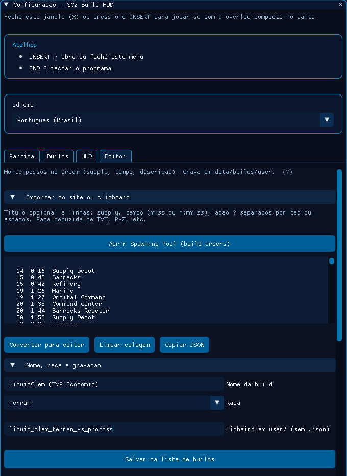
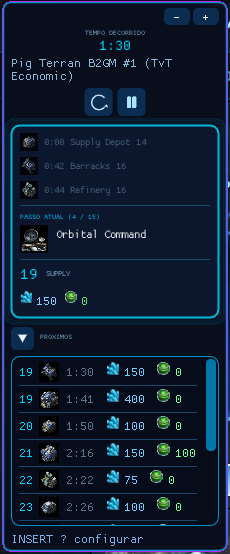

# SC2 Build HUD

Overlay para **Windows** que mostra **build orders** do *StarCraft II* durante a partida: relógio alinhável ao tempo do jogo, lista de passos com ícones e custos estimados, e um editor para importar builds a partir de texto (por exemplo do [Spawning Tool](https://lotv.spawningtool.com/)).

Este projeto é **independente** e **não** é endossado pela Blizzard Entertainment.

## Origem e estado do projeto

Este repositório foi construído com **Vibe Coding** (desenvolvimento assistido por IA em fluxo conversacional): **o autor não escreveu manualmente uma linha de código** — a implementação resultou desse processo.

O projeto **não está completo**: pode faltar **imagens** (os ícones em `data/icons/` são opcionais e, por defeito, costumam estar incompletos), podem existir **bugs**, comportamentos inconsistentes ou funcionalidades por acabar.

**Queres ajudar?** Faz **fork** deste repositório, implementa correções ou novas funcionalidades e abre **pull requests** para o desenvolvimento coletivo.

---

## Funcionalidades

- **HUD compacta** em tela cheia (sempre no topo): tempo decorrido, passo atual, lista **COMING UP**, ícones e custos (mineral/gás) quando disponíveis.
- **Painel de configuração** (tecla **INSERT**): separadores *Match* (relógio), *Builds* (ficheiros JSON), *HUD* (ajuda e colunas), *Editor* (importar / editar / gravar builds).
- **Idioma**: Português (Brasil) e inglês, guardados em ficheiro de definições.
- **Builds em JSON** em `data/builds/presets/` e `data/builds/user/`.
- **Ícones opcionais** em `data/icons/` (PNG), organizados por raça e pasta `common`.

---

## Capturas de ecrã

### Painel de configuração — `docs/BuildHud.PNG`

A janela de **configuração** (abre com **INSERT**) mostra o tema azul neon inspirado no SC2: atalhos (**INSERT** para o menu, **END** para sair), escolha de **idioma**, separadores *Partida / Builds / HUD / Editor* e, neste exemplo, o separador **Editor** com importação de texto (Spawning Tool), botão para abrir o site de builds, área de colagem, conversão para passos e secção **Nome, raça e gravação** antes de salvar na lista.



### Overlay compacta — `docs/BuildOverlay.PNG`

Com o menu fechado (**INSERT**), fica a **HUD compacta** por cima do jogo: **tempo decorrido**, título da build, controlos de temporizador, histórico recente de passos, **passo atual** com ícone e **supply** / mineral / gás, e a lista **PRÓXIMOS** com timings, ícones e custos. O rodapé lembra **INSERT — configurar**.



---

## Requisitos

- **Windows 10 ou superior** (x64 recomendado).
- **Visual Studio 2022** (ou build tools) com carga de trabalho **Desktop development with C++**.
- **Windows SDK** compatível.
- **Direct3D 9** (normalmente disponível no sistema).
- Bibliotecas ligadas pelo projeto: `d3d9`, `windowscodecs`, `ole32`, `shell32`.

---

## Como compilar

1. Clonar o repositório.
2. Abrir `SC2Hud.sln` no Visual Studio.
3. Selecionar configuração **Release** e plataforma **x64** (recomendado).
4. **Build** → *Build Solution*.
5. O executável fica em `x64\Release\SC2Hud.exe` (ou pasta equivalente à configuração escolhida).

**Importante:** ao correr a partir da pasta de saída, mantém a estrutura `data\` ao lado do `.exe` (ou copia a pasta `data` do repositório para junto do executável). O programa procura builds e ícones relativamente ao diretório do executável.

---

## Estrutura de dados

```
data/
  builds/
    presets/     ← exemplos incluídos (JSON)
    user/        ← builds que gravares no Editor
  icons/
    terran/      ← PNGs por nome (ex.: supply_depot.png)
    protoss/
    zerg/
    common/      ← ex.: minerals.png, gas.png para custos na lista
```

Definições da interface (idioma):

- `%LOCALAPPDATA%\SC2Hud\settings.ini`  
  Se `LOCALAPPDATA` não estiver disponível, usa-se uma pasta junto ao executável.

---

## Uso do aplicativo

### Primeira execução

1. Coloca `SC2Hud.exe` com a pasta **`data`** (com pelo menos `data/builds`).
2. Inicia o programa. A **overlay** cobre o ambiente de trabalho (janela transparente por *chroma key* magenta nas áreas vazias).
3. Com o jogo ou outra janela à frente, usa os atalhos abaixo.

### Atalhos globais

| Tecla | Ação |
|--------|------|
| **INSERT** | Abre ou fecha o **menu de configuração** (painel grande). |
| **F11** | Alterna o modo em que a overlay pode receber **foco de teclado** (útil para escrever em campos com o menu fechado). |
| **END** | **Encerra** a aplicação. |

### Separador **Match**

- Alinha o relógio do HUD com o **tempo da partida** no StarCraft II.
- Na hora em que a partida marca **0:00**, usa **Iniciar agora** (ou sincroniza mais tarde com o tempo em segundos e **Aplicar**).

### Separador **Builds**

- Lista ficheiros `.json` em `data/builds` (presets e `user/`).
- **Atualizar lista** se gravaste um ficheiro novo noutro sítio.
- Escolhe uma build e **Carregar esta build** para usar no HUD.

### Separador **HUD**

- Explica o comportamento da overlay compacta (INSERT fechado).
- Opções de **colunas visíveis** na tabela de pré-visualização.

### Separador **Editor**

1. Abre o site de builds (botão que abre [https://lotv.spawningtool.com/](https://lotv.spawningtool.com/) no navegador), copia o texto da build ou cola de outra fonte com o mesmo estilo (supply, tempo, ação).
2. Cola no campo de texto e usa **Converter para editor**.
3. Ajusta **nome, raça e nome do ficheiro** em `user/` (sem `.json`).
4. **Salvar na lista de builds** grava em `data/builds/user/`. Depois, em **Builds**, usa **Atualizar lista** e carrega o ficheiro.
5. **Usar no HUD agora** aplica a build atual ao overlay sem obrigar a gravar ficheiro.

### Overlay compacta (INSERT fechado)

- Mostra **tempo**, **passo atual** e **próximos passos**.
- Ícones vêm dos PNG em `data/icons/` quando o nome coincide com o passo/ico do JSON.
- Clicar numa linha da lista (quando aplicável) pode ajudar a **sincronizar** o tempo com aquele passo.

---

## Créditos e atribuições

### Blizzard Entertainment

- **StarCraft II** e toda a propriedade visual e de marca associada (unidades, edifícios, logótipos, etc.) são propriedade da **[Blizzard Entertainment, Inc.](https://www.blizzard.com/)**
- Este repositório **não inclui** gráficos oficiais extraídos do jogo. Os ficheiros em `data/icons/` são **opcionais** e cabe ao utilizador obtê-los e utilizá-los de acordo com os [termos da Blizzard](https://www.blizzard.com/legal/) e políticas aplicáveis.
- O HUD é uma ferramenta de apoio **não oficial** para prática pessoal.

### Spawning Tool (build orders)

- As builds em formato de texto colado são muitas vezes inspiradas ou copiadas de guias do site **[Spawning Tool — Legacy of the Void](https://lotv.spawningtool.com/)**, um recurso da comunidade para ordens de construção e replays.
- Crédito e agradecimento aos autores e maintainers do Spawning Tool. O aplicativo abre esse site para facilitar a obtenção de builds; **não há afiliação** entre este projeto e o Spawning Tool ou a Blizzard.

### Bibliotecas de terceiros (incluídas ou referenciadas no código)

- **[Dear ImGui](https://github.com/ocornut/imgui)** — interface imediata.
- **[nlohmann/json](https://github.com/nlohmann/json)** — parsing JSON (`third_party/nlohmann/json.hpp`).

---

## Aviso legal

Software fornecido “como está”, sem garantias. Usa por tua conta e risco. Não uses em violação dos termos do StarCraft II ou de serviços terceiros.

### Uso comercial

**É proibido vender** este projeto ou qualquer derivado com o propósito de comercialização (por exemplo: vender o executável, pacotes fechados ou cobrar por licenças sobre este código sem autorização explícita do titular do repositório). O objetivo é partilha **gratuita** com a comunidade; forks e contribuições devem respeitar essa intenção.

---

## Licença

Define a licença do teu código adicionando um ficheiro `LICENSE` na raiz do repositório. As bibliotecas de terceiros (por exemplo Dear ImGui e nlohmann/json) mantêm as respetivas licenças nos projetos originais.
